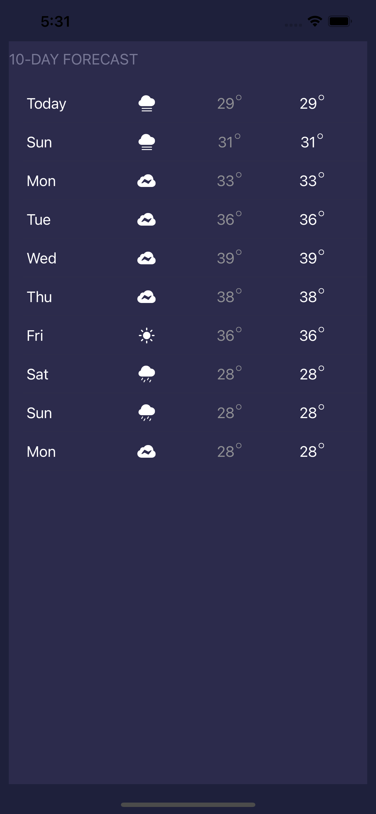
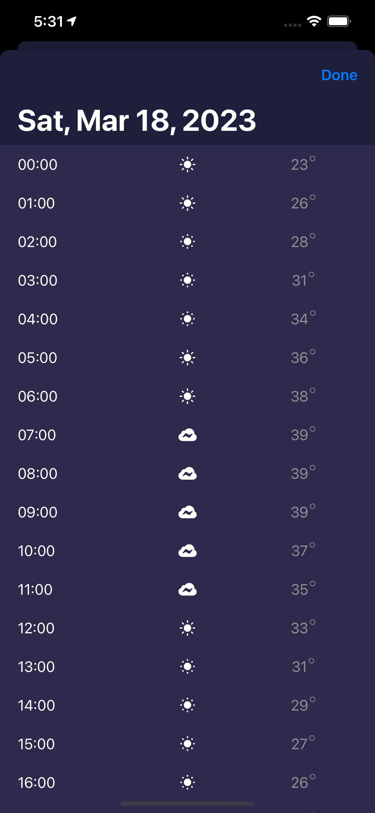

# WeatherKit API implementation in SwiftUI.

This repo contains the implementation of SwiftUI which consuming the WeatherKit Api as the data provider.

## Done

1. Next 10 days forecast
2. Each day forecast by hour.

## Improvement

1. Make component to reuse the UI.
2. Apply Combine module.

## How to run

Please add your Authorization Token to the **line 48, file: APIService.swift** as:

```swfit
request.setValue("Bearer PUT_TOKEN_HERE", forHTTPHeaderField: "Authorization")
            let task = URLSession.shared.dataTask(with: request) {(data , response, error) in
                print("got response")
....
....
```

## Screenshots




